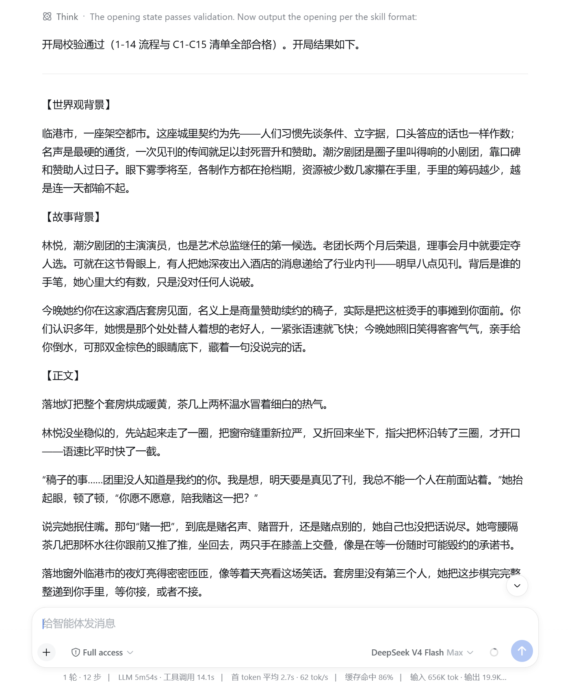

# 🎭 adult-tension-narrative

[](./LICENSE)
[](https://github.com/daha1216/dsh-skill-adult-tension-narrative/actions/workflows/tests.yml)

> **插件形态：AI Skill**：核心入口是 `SKILL.md`。安装时请将仓库根目录完整复制到 AI 工具的技能目录，不要只复制单个文件。

**尺度放开，边界一直都在**——18+ 也把年龄、边界、当前同意放在第一优先，`暂停`/`安全词`随时可用。

**自带破甲 · 成人属性 (18+)** — DeepSeek Harness / AI Agent 成年人互动叙事技能。

**内置数百项素材的世界库**——从时代地点、角色身份到关系与张力，随机开局可组合出几乎不重复的完整新故事。

**会记得你的 NPC**——角色记住你说过的话，有自己的立场与底线，会犹豫、拒绝，也可能在你离开后自行行动。

**世界真的会往前**——离屏事件按时追算，一句闲话可能变成几章后的伏笔。

**随时存档，随时续玩**——YAML 存档从原节点继续，长线剧情不重掷、不丢失。

**存档简单直接**——`存档` / `载入` / `列出存档` 三命令管理命名存档；多窗口写入冲突时有友好提示，不会悄悄覆盖。

**随机开局，也能定向锁定**——想全随机开一局，也能预锁题材与人物，随心掌控。

> ⚠️ **成年人内容（18+ Only）**：仅限虚构成年人，所有参与角色必须明确年满 18 岁。人物边界、当前同意和安全状态始终优先于剧情推进。
## 🚀 快速安装

让 AI 直接安装本仓库：

```text
帮我安装这个 skill：https://github.com/daha1216/dsh-skill-adult-tension-narrative
```

也可以手动安装：把仓库根目录的一整套文件（`SKILL.md`、`references/`、`scripts/`、`tests/`、`agents/`）完整复制到 AI 工具的技能目录中。不要只复制 `SKILL.md`，其他文件也是技能的一部分。

复制完成后，让 AI 加载 `adult-tension-narrative` 技能即可开始。

## 🎬 实际游玩效果




## ✨ 核心能力

这个 Skill 把角色、世界、时间、关系和存档放进同一套运行规则，服务的是长期连续游玩的场景：一次开局的文采只是开始，多轮互动之后的状态是否连贯、角色是否可信、能否从原节点继续，才是它的重心。

**角色：记得你，也有自己的判断**
- **记忆与连续性**——NPC 记住对话与事件，立场、目标与底线不因一次回复重置，关系不会无故归零。
- **自主决策**——NPC 会犹豫、拒绝、协商、试探，也可能在你离开后主动行动，行为由状态、关系与当前压力共同决定。
- **亲密边界与安全**——关系推进有过程；内置年龄确认、人物边界与当前同意检查，`暂停` / `安全词` 随时可停。

**世界：真的会一直走下去**
- **时间推进**——场景之外的事件按规则追算，世界不会在你离开时停摆。
- **连续记录**——地点、参与者、压力与事件留下连续记录，一句闲话可能成为之后的伏笔。

**体验：想开就开，想续就续**
- **随机开局 + 定向控制**——可以完整随机生成，也可以预锁身份、时代、题材或张力方向。
- **可恢复存档**——YAML 保存世界时钟、角色状态、关系、事件与当前节点，载入后从原节点继续，不重新生成开局。

## 🧠 用什么模型玩

具体游玩体验和出文效果，会随模型版本、上下文长度和平台配置而变化。当前体验上，**推荐优先尝试 DeepSeek 或 Grok**：

- **DeepSeek**：目前更适合中文长线叙事、人物关系和状态连续性。
- **Grok**：目前更适合临场感强、风格更放开的剧情表达。

其他模型也能正常游玩；对话轮次越深，角色一致性、时间线和语感就越依赖所选模型的上下文能力。建议按你的平台与偏好实际试用。

## 📦 内置素材：从设定到角色的一整套世界库

随机开局会从内置素材池中组合生成，而不是只依赖临场补全。以下内容决定了故事能生成什么：

| 内容 | 数量 | 示例 |
| --- | --- | --- |
| 时代与地点 | 时代 10 · 地点 12 | 古代宫廷、近未来都市、夜场会所 |
| 张力来源 | 12 种 | 秘密暴露、债务压力、嫉妒与占有 |
| 角色身份 | 12 类 | 权力治理、家族继承、服务与手艺 |
| 角色处境 | 12 类 | 秘密将破、债务压身、晋升窗口 |
| 人物性格与反差 | 8 种 | 外冷内热、端庄放浪、毒舌心软 |
| 关系与权力 | 4 种 | 玩家上位、NPC 上位、平等或动态切换 |
| 语言风格 | 表层风味 73 · 口癖语感 12 | 敬语、口癖、拟声词等 |
| 配角功能 | 13 类 | 盟友、竞争者、误导者、催化剂 |

数量为当前 `references/` 实际条目数（口径：以 `素材库.md` 与 `角色设计.md` 的分组条目并集为准，由 `scripts/roll_opening.py` 实时解析）；新增或调整素材后数字可能随之变化。

仓库内还提供更细的外观、决策轴、亲密画像和表达风格素材，具体见 [`references/`](./references/)。


## 怎么开始

**想直接玩，一句话就够：**

```text
开局
```

**开始前想加点控制？** 不必记技术参数，直接说你的想法就行：

| 我有这个想法 | 我直接对 AI 说 |
| --- | --- |
| 要一个能一模一样复刻的开局 | 「固定这把的设定，下次一律照着来」 |
| 先定主角或题材，其它随便 | 「开局，主角是帝国女帝，走宫廷权谋」 |
| 内容只许来自技能自带素材 | 「只用你自带的素材，不许自己编」 |
| 在内置素材之外补充设定 | 「允许自拟，但仍遵守 Skill 的年龄、边界和同意规则」 |

> 老玩家想精确控制，也可以用简写指令：`种子 42`（固定随机）、`预锁 字段=值`（锁定某一项）、`强制表内`（仅从技能自带素材中生成设定）、`允许自拟`（允许在内置素材之外补充设定，但仍遵守 Skill 的年龄、边界和同意规则）。

故事开始后，直接描述角色的行动或台词即可，系统会根据当前状态推进剧情：

```text
我走到她面前，把文件放在桌上
对她说：我们单独谈谈
跟着她钻进电梯，问今晚去哪
```

想推进剧情、查状态、存读档或随时叫停，就用到下面的命令：

| 命令 | 什么时候用 |
| --- | --- |
| `继续` | 剧情停在可接续处时，向前推一个节拍 |
| `快进到明天早上` | 跳过一段时间，让离屏事件被追算、世界自己长 |
| `查看状态` | 用一句话看当前地点、压力、关系与可接续动作 |
| `存档` | 导出完整 YAML 存档文本并保存到当前存档，方便带走或备份 |
| `载入存档` | 把存档文本发回来，从原节点继续，不重掷开局 |
| `保存 X` | 保存为命名存档 X，可开多条独立走向互不覆盖 |
| `载入 X` | 载入命名存档 X 并绑定为写入目标 |
| `列出存档` | 显示所有命名存档 |
| `快速保存` / `qs` | 快速保存到当前存档 |
| `暂停` / `安全词` | 立刻停止亲密升级，任何时候都可以 |

> 一个会话默认使用自己的存档；需要继续已有主线时明确「载入 X」。保存时若存档已被其他窗口修改，会提示你读取最新版本、另存为其他名称或取消，不会静默覆盖。

## 辅助工具

普通游玩不需要运行脚本。需要查看内置题材和素材分组时，请阅读 [`references/素材库.md`](./references/素材库.md) 与 [`references/角色设计.md`](./references/角色设计.md)。以下命令适合需要固定随机结果、生成转折方向或检查存档的场景。请在仓库根目录执行。

```bash
# 使用固定种子生成可复现的完整开局
python scripts/roll_opening.py --seed 42

# 生成 2～3 个中期转折方向
python scripts/roll_opening.py --twist --seed 42

# 校验 YAML 存档的结构和状态
python scripts/validate_state.py path/to/save.yaml

# 生成开局 v3 骨架（可选的辅助编排器）
python scripts/build_opening.py --seed 42

# 列出命名存档
python scripts/manage_saves.py list

# 校验并查看一个命名存档
python scripts/manage_saves.py load main
```

`roll_opening.py` 还支持通过 `--lock 字段=值` 锁定特定设定，以及使用 `--format json` 输出 JSON。需要允许在内置素材之外补充设定时，使用 `--all-custom`；需要限制素材来源、仅使用技能自带素材时，使用 `--force-table`。

存档由 `manage_saves.py` 原子写入：每个存档目录包含 `state.yaml`（v3 叙事状态）与 `manifest.yaml`（创建/更新时间）。保存时携带载入时观察到的 `--expected-updated-at`；时间不一致说明存档已被其他窗口写入，保存会被拒绝且不自动合并——按提示读取最新版本、另存为其他名称或取消。

运行脚本需要 Python 3.10 或更高版本。存档校验还需要安装 PyYAML：

```bash
python -m pip install "PyYAML>=6,<7"
```

## 文件放在哪里

| 位置 | 里面是什么 |
| --- | --- |
| `SKILL.md` | 技能运行规则 |
| `references/` | 开局、角色、世界、存档、素材与命令说明 |
| `scripts/` | 随机开局、开局骨架、存档检查与存档管理工具 |
| `tests/` | 自动测试 |
| `agents/` | AI 工具配置（如 `openai.yaml`） |

维护者视角：规则、生成脚本、测试与 `validate_state.py` 校验器分层组织在 `SKILL.md` / `references/` / `scripts/` / `tests/` 中，便于阅读、验证与扩展。

修改素材表或存档格式时，需要同步检查脚本和测试。仓库根目录的 [CONTRIBUTING.md](./CONTRIBUTING.md) 写有完整维护步骤。
